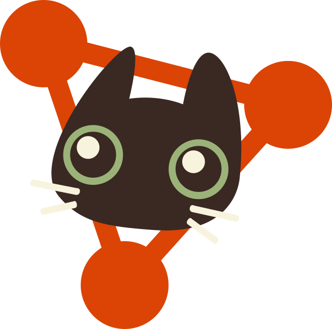

# Pet Foster Connect

## Disclaimer

Ce dépôt contient une conversion de l'API utilisée par PetFosterConnect en langage Rust, s'appuyant sur le framework Actix Web tout en conservant les mêmes fonctionnalités.

## Présentation

Pet Foster Connect permet de mettre en relation des familles d’accueil pour les animaux avec des associations de protection animale.

PFC permet aux gens de jouer un rôle fondamental en accueillant des animaux en attendant leur adoption définitive afin de leur offrir une meilleure vie.

PFC a pour vocation de répondre à plusieurs besoins :

- Les animaux aimeraient bien un toit, et les gens aiment les animaux (en général)
- Permettre aux associations / refuges de communiquer sur les animaux nécessitant une place au chaud
- Permettre aux familles d'accueil de se faire connaître et de se mettre en relation avec les refuges / associations

## Technologies utilisées

Pour réaliser cette application, nous nous sommes noatemment servis de :

| **Nom** | **Utilité** |
| -------------- | ---------------- |
| Rust | Langage |
| Actix Web | Framework |
| PostgreSQL | Base de données |
| SeaORM | ORM |
| Dotenv | Environnement |
| env_logger & log | Historique |
| Bcrypt | Algorithme de hachage |
| JsonWebToken | JWT |